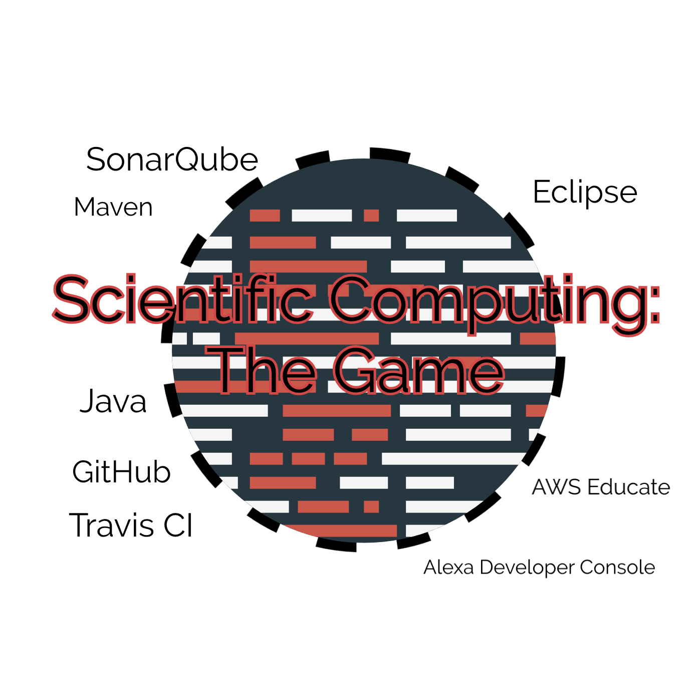
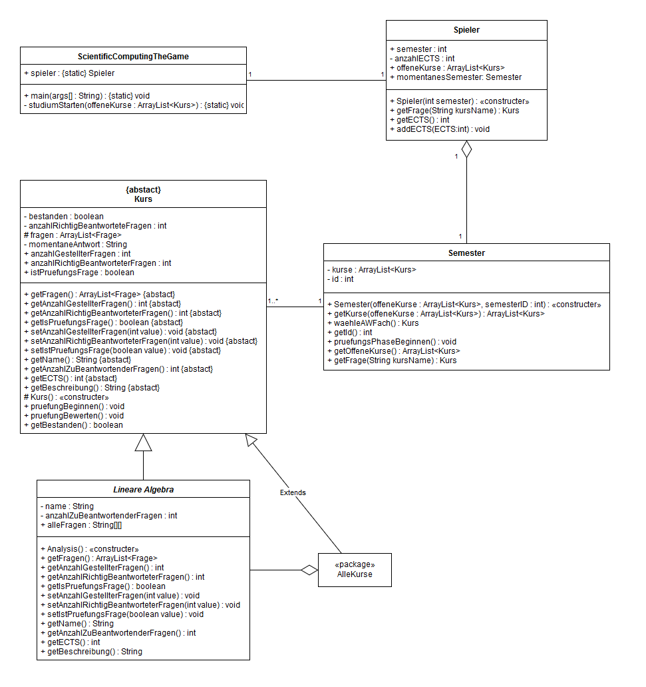
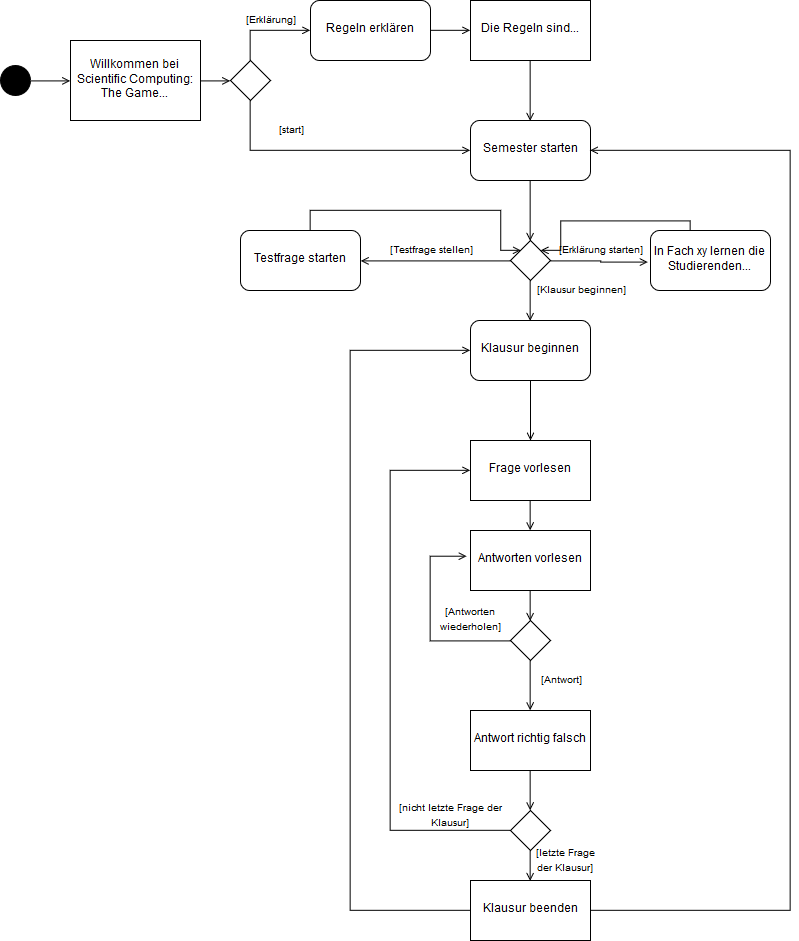

# Alexa Skill "Scientific Computing The Game"
Der Skill soll den Studiengang Scientific Computing als Spiel nachstellen. Dafür werden jedes Semester die entsprechenden Kurse gestartet. 

Als Prüfungsvorbereitung können unächst einige Probefragen gestartet werden um sich auf die Klausur vorzubereiten. Außerdem stehen zu jedem Fach kurze Erklärungen der wichtigsten Inhalte bereit.

Um schließlich die Prüfung zu bestehen muss eine bestimmte Anzahl an Fragen richtig beantwortet werden. Immer wenn genug Fragen korrekt beantwortet wurden wird der Kurs beendet und dem Spieler die entsprechende Anzahl an ECTS Punkten gutgeschrieben. Falls die Prüfung jedoch nicht bestanden wurde muss sie im nächsten Semester wiederholt werden.

## Grobe Technische Erklärung

Zu Beginn startet der Studierende ein Semester. Dabei wird eine List mit offenen Fächern erstellt. Diese entsprechen den Fächern des ersten Semesters des Studiengangs Scientific Computing. Nun kann der Studierende Probefragen zu diesen Fächern beantworten. Wenn er sich bereit für die Klausur fühlt kann er diese Beginnen. Um zu bestehen müssen nun genug Fragen richtig beantwortet werden. Wird die Prüfung bestanden wird dieses Fach aus der Liste der offenen Fächer entfernt und dem Studierenden die entsprechende Anzahl ECTS gutgeschrieben. Wenn alle Klausuren beendet wurden wird das nächste Semester gestartet. Dafür werden der Liste mit den noch nicht bestandenen Prüfungen diejenigen für das entsprechende Semester hinzugefügt. Dieser Vorgang wiederholt sich bis der Studierende 210 ECTS Punkte erreicht und den Bachelor of Science erreicht. 

## Status

##### noch austauschen!!!

## Fachklassenmodell

## Anwendungsfalldiagramm

## Was wir in den letzten Monaten gelernt haben
- Der Sinn und die Funktionsweise von GitHub als Tool zur Versionsverwaltung.
- Wie schwer es sein kann viele schlaue Köpfe mit noch mehr schlauen Ideen unter einen Hut zu bringen.
- Wie viel man erreichen kann wenn man in einer Gruppe zusammenarbeitet.
- Warum Sprachassistenten kritisch gesehen werden sollten.
