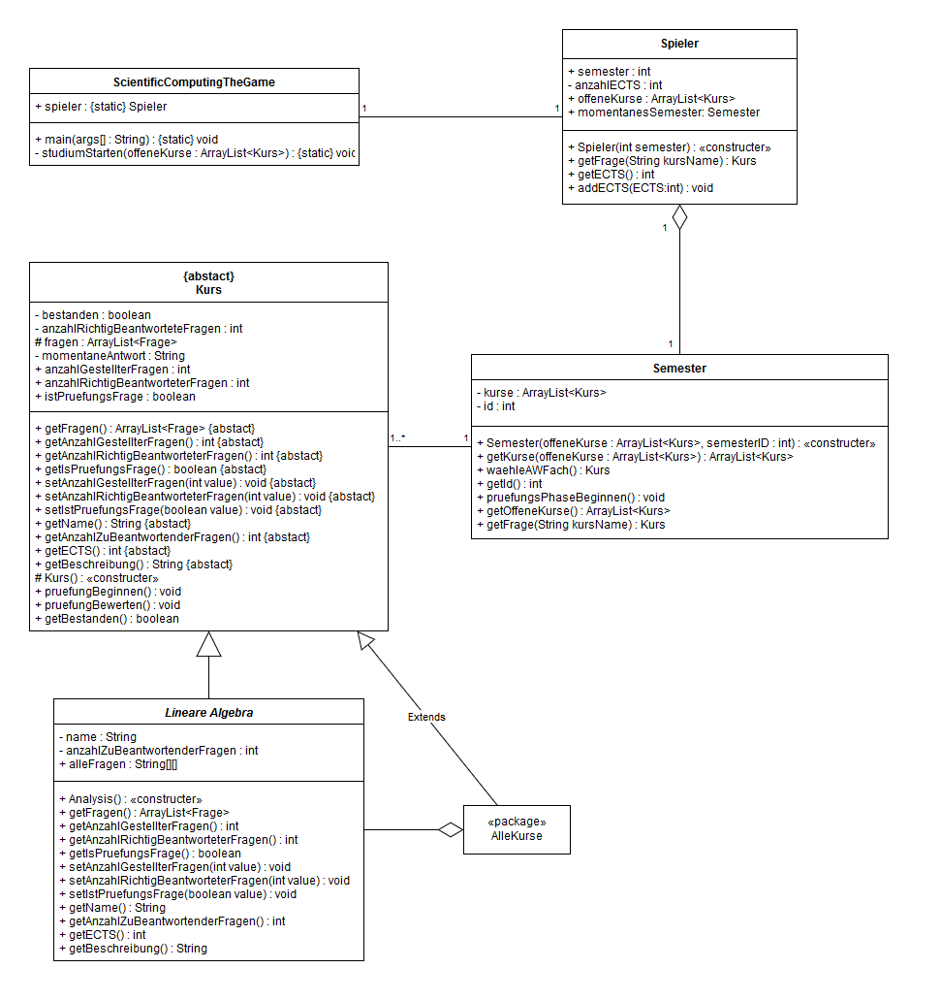

# Alexa Skill "Scientific Computing The Game"
Der Skill soll den Studiengang Scientific Computing als Spiel nachstellen. Dafür werden jedes Semester die entsprechenden Kurse gestartet. 

Als Prüfungsvorbereitung können unächst einige Probefragen gestartet werden um sich auf die Klausur vorzubereiten. Außerdem stehen zu jedem Fach kurze Erklärungen der wichtigsten Inhalte bereit.

Um schließlich die Prüfung zu bestehen muss eine bestimmte Anzahl an Fragen richtig beantwortet werden. Immer wenn genug Fragen korrekt beantwortet wurden wird der Kurs beendet und dem Spieler die entsprechende Anzahl an ECTS Punkten gutgeschrieben. Falls die Prüfung jedoch nicht bestanden wurde muss sie im nächsten Semester wiederholt werden.

## Status

##### noch austauschen!!!

## Fachklassenmodell

## Systemarchitektur

## Anwendungsfalldiagramm

##### noch austauschen

## Klassendiagramm des AWS Lambda Funktion

#### noch austauschen

## Aktivitätsdiagramm Lieblingsfarbe eingeben

#### noch austauschen

## Was wir in den letzten Monaten gelernt haben
- Der Sinn und die Funktionsweise von GitHub als Tool zur Versionsverwaltung.
- Wie schwer es sein kann viele schlaue Köpfe mit noch mehr schlauen Ideen unter einen Hut zu bringen.
- Wie viel man erreichen kann wenn man in einer Gruppe zusammenarbeitet.
- Warum Sprachassistenten kritisch gesehen werden sollten.
